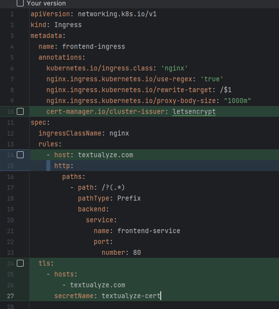

# 🎬 Textulayze

> **Automatic Video Subtitles**

---

## 🌟 Overview

**Textulayze** revolutionized video accessibility by providing an automated subtitling platform that served **1,600+ users globally**. This complete full-stack solution, combined cutting-edge AI technology with intuitive design to deliver professional-grade subtitle generation and styling capabilities.

### 🏆 Notable Achievements

- **Global Reach**: Served creators across multiple continents
- **Enterprise Clients**: Trusted by industry leaders including **MyFitness** (Estonia's premier gym franchise)
- **Creator Network**: Powered content for renowned Estonian influencers and stand-up comedians
- **AI-Powered**: Leveraged advanced speech recognition for accurate subtitle generation
- **Customizable**: Offered extensive styling options for brand consistency

---

## 🚀 Key Features

- **🤖 Automated Transcription**: AI-powered speech-to-text conversion
- **🎨 Custom Styling**: Full control over subtitle appearance and branding
- **⚡ Real-time Processing**: Fast turnaround for time-sensitive content
- **🌍 Multi-language Support**: Catering to diverse global audiences
- **📱 Cross-platform**: Seamless experience across devices

---

## 🛠️ Technical Achievement

**Solo Development**: This entire platform was conceived, designed, and implemented by **me** as a **single-developer project**. The technical scope included:

- **Full-Stack Architecture**: Frontend, UI/UX design, backend, database design, and deployment
- **AI Integration**: Speech recognition and natural language processing
- **Cloud Infrastructure**: Scalable deployment and monitoring systems
- **DevOps**: CI/CD pipelines, containerization, and orchestration

---

## 📚 Development Notes

*The following documentation contains comprehensive development notes from the project lifecycle, including components and services that may no longer be active (Kafka, Debezium, Python services).*

# 1. @hendrikytt:
(in UI directory)
1. Login: `npm login`
2. Build: `tsc`
3. Publish: `yarn publish --access public`

In repo:

interactive upgrade:
`yarn upgrade @hendrikytt/api-contracts@^`

# 2. api
Commands used:
1. `yarn init -y`
2. `yarn add typescript express knex pg cors express-promise-router mocha chai chai-http`
3. `yarn add --dev @types/node @types/express @types/express-promise-router nodemon ts-node @types/pg @types/cors @types/mocha @types/chai @types/chai-http`
4. `yarn add --dev ts-node-dev`

Postgres:

`docker run --name postgres16 -p 5432:5432 -e POSTGRES_USER=postgres -e POSTGRES_PASSWORD=postgres -d postgres:16`

Useful queries:

Get users with ip addresses data
```
SELECT *
FROM users u
JOIN ip_addresses ia ON u.ip_addresses ? ia.ip_address;
```

Redis:

`docker run --name redis7 -p 6379:6379 -d redis`

stripe:

`stripe listen --forward-to localhost:3000/stripe/webhook`

`stripe trigger checkout.session.completed`

### Database backup flow:

Show running cron jobs:

`crontab -l`

Assuming database has been backed up to S3
PS. Don't have debezium anymore, so skip debezium steps
0. To forcibly delete dbz db (you have to do it kind of fast, else dbz will re-connect):

```
SELECT pg_drop_replication_slot('debezium');
--1st you get error that some PID is using it if you try to delete replication slot, then:
SELECT pg_terminate_backend(9270);
-- delete replication slot again
SELECT pg_drop_replication_slot('debezium');
```
kafka stuff above

BASE STEPS:
1. Delete database in pgAdmin
2. Delete pgdata folder in remote server through VSCode
3. Delete postgres deployment (kubectl delete)
4. Scale apis to 0
5. Apply postgres deployment
6. In `/home/scripts/backup_database` run `./restore_database.sh` MAKE SURE TO replace RESTORE_FILENAME with the actual file name in the script
7. Scale apis up again
8. should be ok now


kafka stuff below
9. Restart kafka
10. Restart kafka-dbz 
11. Restart consumer 
12. Now it should be ok again, test with sale-info


### Remotion lambda:
1. Deploy site:
```npx remotion lambda sites create src/index.ts --site-name=my-video --enable-folder-expiry```
2. Render a video:
 ```npx remotion lambda render <serve-url> VideoWrapper --delete-after="1-day"```

Get compositions
```npx remotion lambda compositions <serve-url>```

Delete lambda functions:
```npx remotion lambda functions rmall -y```

Delete projects:
```npx remotion lambda sites rmall -y```

Check that versions match:
```npx remotion versions```

Experiment with 20 min video: https://www.youtube.com/watch?v=yXWw0_UfSFg

Memory size 2048mb:
Time to render: 3:23, cost: 0.43USD

Memory size 10240mb:
Time to render: 1:39, cost: 1.05USD


### Differences with frontend remotion files:
1. ``utils``
-
2. ``AliTemplate``
    - font weight is different
3. ``VideoWrapper``
    - different name
    - loads font
    - previews
    - < OffthreadVideo/> vs < Video/>
    - video src comes from s3 link, not locally
4. ``Subtitle``
    - doesn't have smallerThanSm
    - uses adjustedHeight/adjustedWidth (because it renders actual video, not compressed one)


### Switching out worker flow:

This flow will enable smooth worker deployments:

1. Worker needs to be switched out
2. Add entry to entries with url
3. wait until old one’s request_ids_… are []
4. set old one is_locked to true
5. delete original entry

And flow can continue as usual with no downtime

# 3. containers
dev3 ip:
`65.109.87.173`

THIS IS IMPORTANT. Edit ingress controller YAML and add it to externalIPs under spec:

`microk8s kubectl edit svc ingress-nginx-controller`

hetzner ip:
`95.216.172.81`

1. deployment YAML and apply it
2. service YAML and apply it
3. Install the NGINX Ingress Controller, ingress YAML and apply it

### SERVER STEPS:
0. Get server from Hetzner and SSH into it
1. `sudo apt update`
2. `sudo apt install snapd`
3. `sudo snap install microk8s --classic`
4. `microk8s helm repo add ingress-nginx https://kubernetes.github.io/ingress-nginx`
5. `microk8s helm repo update`
6. `microk8s helm install ingress-nginx ingress-nginx/ingress-nginx`
7. `microk8s config` - copy and paste that to local
8. `kubectl apply -f https://github.com/cert-manager/cert-manager/releases/download/v1.13.0/cert-manager.yaml`
9. Apply YAML files, maybe try applying issuer.yaml separately
10. Now, how to access it at URL, currently only possible by port forwarding...
11. `microk8s enable metallb` - added this range: 192.168.1.200-192.168.1.210
12. `microk8s enable ingress` - after this it shows that connection is not private
13. `kubectl delete -f .`
14. `kubectl apply -f .`
15. `microk8s enable metrics-server` - metrics for the cluster

Maybe could help as well steps:
1. sudo ufw allow 16443
2. sudo nano /var/snap/microk8s/current/args/kube-apiserver
2. Add these 2 lines:
```
   --bind-address=0.0.0.0
   --advertise-address=95.216.172.81
```


Merged configs:

`KUBECONFIG=~/.kube/config:~/microk8s-config`
`kubectl config view --flatten > merged-config`
`mv ~/.kube/merged_config ~/.kube/config`


telepresence stuff (ensure it is in PATH):
0. install it
1. Intercept api deployment in the cluster: `telepresence intercept api --port 3000:80 --env-file .env`
2. start the application and you are ready

Stop it:
`telepresence leave api`

List:
`telepresence list`

Quit:
`telepresence quit -s`

Automatic issue TLS certificates in Kubernetes with Let's Encrypt:
1. `kubectl apply -f https://github.com/cert-manager/cert-manager/releases/download/v1.13.0/cert-manager.yaml`
2. Create issuer.yaml file, add contents and apply https://cert-manager.io/docs/configuration/acme/#configuration
3. Update ingress yaml file:

TLS certificate renewal:
(not 100% about this...)
You can look certificate data in Certificate resource
1. `kubectl delete -f https://github.com/cert-manager/cert-manager/releases/download/v1.13.0/cert-manager.yaml`
2. `kubectl apply -f https://github.com/cert-manager/cert-manager/releases/download/v1.13.0/cert-manager.yaml`
3. Create issuer.yaml file, add contents and apply https://cert-manager.io/docs/configuration/acme/#configuration


If critical CPU levels:
1. `top`
2. `sudo kill <PID>`

In k8s:
Current node (server) has 4vCPUs (4000m total)
CPU - measured in 1m (millicore)

And it has 16GB RAM
MEM - measured in MiB (Mebibytes)
Examples in idle state:
1. api - CPU: 25m; MEM: 47Mi
2. frontend - CPU: 0m; MEM: 5Mi 

Grafana:
1. Create grafana.yaml and grafana-pv.yaml, look at those files in this directory
2. `kubectl apply -f grafana.yaml grafana-pv.yaml`


Loki (in server):
1. `microk8s helm repo add grafana https://grafana.github.io/helm-charts`
2. `microk8s helm repo update`
3. values.yaml:
```
loki:
  commonConfig:
    replication_factor: 1
  storage:
    type: 'filesystem'
singleBinary:
  replicas: 1
``` 
4. `microk8s helm install --values values.yaml loki grafana/loki`

update image command stubs:

`kubectl set image deployment/api api=hendrikutt/api:`

`kubectl set image deployment/api-renderer api-renderer=hendrikutt/api:`

`kubectl set image deployment/frontend frontend=hendrikutt/frontend:`

Secret to pull images from private repositories:

`kubectl create secret docker-registry myregistrysecret --docker-username=DOCKER_USERNAME --docker-password=DOCKER_PASSWORD --docker-email=DOCKER_EMAIL`

And then add this to yaml file:

```
imagePullSecrets:
    - name: myregistrysecret
```

How to delete old files in PROD:<br>
```find . -type f -mtime +10 ! -name "placeholder.txt" -delete```

How to delete old files in PROD full path:<br>
```find /mnt/HC_Volume_100043635/incoming_request_payloads -type f -mtime +9 ! -name "placeholder.txt" -delete```

Show files with ordered created_at:<br>
```ls -lt```

# 4. frontend
Used commands:

1. `yarn create react-app frontend --template typescript`
2. `yarn add antd @types/antd react-router-dom`
3. `yarn add --dev @types/react-router-dom`
4. `yarn add --dev eslint`
5. `yarn eslint --init` (use custom settings here)
6. Dockefile
7. config.js
8. `<script src="%PUBLIC_URL%/config.js"></script>` into index.html file

Run container:
`docker run -p 8080:80 frontend1`

And then check automatic configuration in eslint settings

Adding new article:
1. Update src/articles/articlesData.ts
2. Add md file, fill it and also add images in public/markdown
3. Update public/sitemap.xml

# 5. worker

CURRENTLY PREFERRING large-v2 instead of large-v3, because it seems to have more accurate word-level timestamps

Install whisper

`pip install -U openai-whisper`

Uninstall pytorch

`pip3 uninstall torch torchvision torchaudio`

`pip3 cache purge`

Install cuda-python and Torch cuda

`pip install cuda-python`

To install pytorch you can choose your version from the pytorch website https://pytorch.org/ see INSTALL PYTORCH section

`pip3 install torch torchvision torchaudio --index-url https://download.pytorch.org/whl/cu118`

Running app like this seems optimal for decent-sized GPU:
`--workers=6 --threads=4`

+cu118 DOES NOTTT WORK in local or prod

### Running locally:
Windows:

1. `cd src`
2. `$env:FLASK_APP="app.py"`
3. `flask run --host=0.0.0.0 --port=5000`

WSL:

1. `cd src`
2. `export FLASK_APP=app.py`
3. `flask run --host=0.0.0.0 --port=5000`

### Connecting:

RunPod SSH example:
`ssh 73mvd9czhz18gl-64410fc6@ssh.runpod.io -i ~/.ssh/id_ed25519`

### FFMPEG:

#### Installing

Windows:
1. Download "latest git master branch build" (ffmpeg-git-full.7z)<br>
https://www.gyan.dev/ffmpeg/builds/

2. Extract folder contents to "ffmpeg" folder on C drive
3. Set ffmpeg to path:<br>
DO IT IN ENVIRONMENT VARIABLES

DO NOT USE THIS, this will mess up all env variables:
`setx /m PATH "C:\ffmpeg\bin;%PATH%"`

4. Restart your system

Should be similar in Linux as well

Example FFMPEG command:
`ffmpeg -nostdin -i iphone_video.MOV -vf "subtitles=subs.srt:force_style='Fontname=FSP DEMO - Biennale Heavy,Fontsize=12,PrimaryColour=&Hace653,OutlineColour=&Hff7b43,BorderStyle=3,MarginV=0,MarginL=0'", -preset fast -threads 4 -r 60 -slices 4 -c:a copy -c:v h264_nvenc output2.mp4`

With .ass subtitles:
`ffmpeg -nostdin -i iphone_video.MOV -vf "subtitles=subs_aegis.ass'", -preset fast -threads 4 -r 60 -slices 4 -c:a copy -c:v h264_nvenc output2.mp4`

Input is audio:
`ffmpeg -loop 1 -i blank.jpg -i audio.mp3 -vf "subtitles=subs_aegis.ass" -preset fast -threads 4 -r 60 -slices 4 -c:a copy -c:v h264_nvenc -shortest output3.mp4`

yt-dlp example command:
`yt-dlp --newline -f bestvideo[ext=mp4] -o "C:\\Users\\Hendrik\\Documents\\pet-project-v2\\worker\\src\\9f6958f0-add1-41d2-a846-af0010693e52.mp4" "https://www.youtube.com/watch?v=lyAesdpoB78&t=2s&ab_channel=Hendrik]"`

Get file info (UNIX):
`ffmpeg -i filename.mp4 -hide_banner -f null /dev/null 2>&1`

Get file info (Windows):
`ffmpeg -i filename.mp4 -hide_banner -f null NUL 2>&1`

With ffprobe:
`ffprobe -v error -select_streams v:0 -show_entries stream=bit_rate -of default=noprint_wrappers=1:nokey=1 filename.mp4`

#### Extra stuff:

HOW TO RUN LOCALLY:
0. CUDA Toolkit version - 11.8, Python version - 3.11
1. `pip3 install torch torchvision torchaudio --index-url https://download.pytorch.org/whl/cu118`
2. Install requirements
2. CUDA Toolkit - download and install (also Visual Studio)
2. cudnn library - download and then copy over files from folders here to CUDA toolkit folders (bin, include, lib/x64)
3. ENV variables:

   `CUDA_PATH=C:\Program Files\NVIDIA GPU Computing Toolkit\CUDA\v11.8`

   System Path variables:

   `C:\Program Files\NVIDIA GPU Computing Toolkit\CUDA\v11.8\bin`

   `C:\Program Files\NVIDIA Corporation\Nsight Compute 2022.3.0\`

5. Restart PC

CUDA error:

`AssertionError: Torch not compiled with CUDA enabled`

Fix:

`pip uninstall torch torchvision torchaudio`

`pip install torch torchvision torchaudio -f https://download.pytorch.org/whl/cu118/torch_stable.html`


Worker managing:

Booting up takes about 2-4 mins, depending on which GPU instance you rent.
Rebooting takes about 10-15 seconds.

Get renders from S3:
`aws s3 ls s3://remotionlambda-useast1-1wb7idzwx7 --recursive | awk '$1 " " $2 > "2024-08-01 22:00" && !/lambda-initialized-chunk/'`